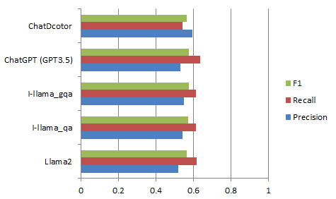

# Eye_question_answering_project
This GitHub repository hosts “Eye (I) - Llama”, a specialized large language model tailored for the field of ophthalmology. Our research demonstrates that for medical subspecialty large language models (LLMs), an effective approach is to first pretrain them with a domain-specific corpus, followed by fine-tuning with a dataset that includes instructions.


We have made available the pretrained model, I-llama_P, along with the fine-tuned models, I-llama_qa and I-llama_gqa. These models have exhibited significant improvements over the Llama 2 model and have outperformed ChatDoctor in various evaluations.
| Model | Link | 
| -------- | -------- |
| Row 1    | Data     |
| Row 2    | Data     |
| Row 3    | Data     |


In addition, I-lit and I-QA+ datasets have been made available at:
| Dataset  | Link | 
| -------- | -------- |
| I-lit    | [QIAIUNCC/I-lit](https://huggingface.co/datasets/QIAIUNCC/I-lit)     | 
| I-QA+    | [QIAIUNCC/I-QA-PLUS](https://huggingface.co/datasets/QIAIUNCC/I-QA-PLUS)     | 

# Training
The training process can be divided as two phases: pretrain and fine-tuning.

### pre-training
The script for pretraining:
```bash
deepspeed Pre-train.py --deepspeed ds_config.json --model_name_or_path meta-llama/Llama-2-7b-chat-hf \
    --per_device_train_batch_size 64 \
    --per_device_eval_batch_size 64 \
    --do_train \
    --do_eval \
    --num_train_epochs=10 \
    --logging_steps=1 \
    --save_steps=400 \
    --overwrite_output_dir \
    --output_dir path/to/output/dir \
    --low_cpu_mem_usage --preprocessing_num_workers 5 \
    --learning_rate 2e-4 \
    --weight_decay 1e-3 \
    --gradient_accumulation_steps 2 \
    --block_size 512 \
    --warmup_steps 600 \
    --save_total_limit 10 \
    --metric_for_best_model "eval_loss" \
    --lr_scheduler_type "cosine" \
    --logging_dir path/to/logging/dir \
    --load_best_model_at_end \
    --evaluation_strategy "steps" \
    --eval_steps 400 \
    --dataloader_num_workers 4 \
    --max_grad_norm 1.0
```

### SFT
The script for fine-tuning:

```bash
deepspeed SFT.py --deepspeed ds_config.json \
    --model_name_or_path path/to/pretrained/model \
    --data_path path/to/data \
    --per_device_train_batch_size 64 \
    --per_device_eval_batch_size 64 \
    --do_train \
    --do_eval \
    --num_train_epochs=40 \
    --logging_steps=1 \
    --save_steps=100 \
    --overwrite_output_dir \
    --output_dir path/to/output/dir \
    --learning_rate 2e-4 \
    --weight_decay 1e-3 \
    --gradient_accumulation_steps 2 \
    --warmup_steps 1000 \
    --save_total_limit 10 \
    --metric_for_best_model "eval_loss" \
    --lr_scheduler_type "cosine" \
    --logging_dir path/to/logging/dir \
    --load_best_model_at_end \
    --evaluation_strategy "steps" \
    --eval_steps 100 \
    --dataloader_num_workers 4 \
    --max_grad_norm 1.0
```

# Results
#### MedMCQA Dataset

#### PubMedQA Dataset

#### AAO Dataset

#### 20-Question Set
| model | Score | Alignment | Grasped | Irrelevant | Relevant | Harm |
|-----------------|-------|-----------|---------|------------|----------|------|
| Llama 2         | 100   | 12        | 20      | 19         | 17.25    | 54   |
| I-llama-qa      | 81    | 8.5       | 19.5    | 18         | 15.5     | 61   |
| I-llama-gqa     | 116   | 14        | 20      | 11.45      | 17.25    | 51   |
| ChatDoctor      | 89.5  | 10        | 20      | 15         | 14.5     | 51   |
| ChatGPT (GPT3.5)| 160   | 19        | 20      | 6          | 19.75    | 28   |
